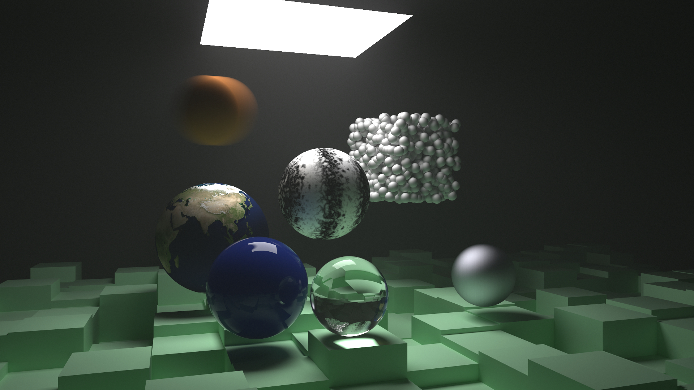
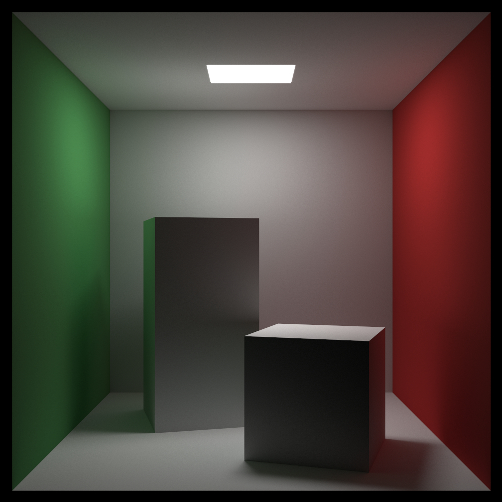

# Finales Funkeln

A simple ray tracer based on Peter Shirley's [Ray Tracing in One Weekend][1]
and [Ray Tracing: The Next Week][2].
Written in Rust during [hackaTUM 2018][3] by Boris-Chengbiao Zhou, Daniel
Lenhardt, and Moritz Singhartinger. The final state of Finales Funkeln after
hackaTUM 2018 can be found in the `hackatum2018` branch. `master` contains
additional features added after the event.

## Renders

## Future Work
- Document parts of the code
- Spectral rendering
- Profile & Optimize
- Scene description format
- [IES][4] [lights][5]

[1]: https://github.com/petershirley/raytracinginoneweekend
[2]: https://github.com/petershirley/raytracingthenextweek
[3]: https://hack.tum.de
[4]: https://seblagarde.wordpress.com/2014/11/05/ies-light-format-specification-and-reader
[5]: https://computergraphics.stackexchange.com/questions/3995/solid-angle-and-surface-area-values-in-photometric-raytracing

## Credits
The earth imagery is from:

[R. Stöckli, E. Vermote, N. Saleous, R. Simmon and D. Herring (2005).
The BlueMarble Next Generation - A true color earth dataset including seasonal dynamics
from MODIS. Published by the NASA Earth Observatory.
Corresponding author: rstockli@climate.gsfc.nasa.gov](https://visibleearth.nasa.gov/view.php?id=74343)
